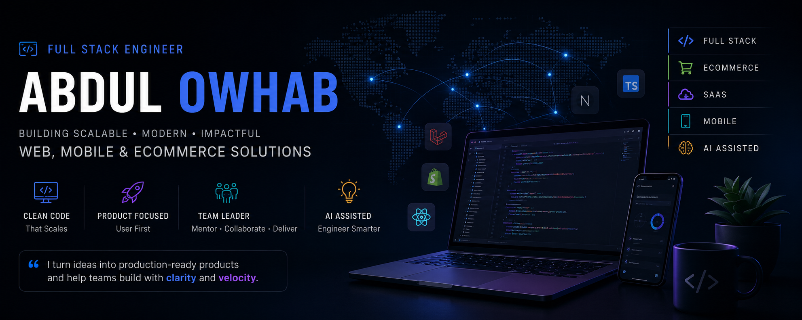

<!-- Banner -->

[Portfolio](https://abdulowhab.netlify.app) • [LinkedIn](https://linkedin.com/in/abdulowhab) • [GitHub](https://github.com/Owhab) • [Email](mailto:mail.owhab@gmail.com)

---

## About Me

I'm a Full Stack Engineer with 4+ years of experience building production-grade web and mobile applications across ecommerce, SaaS, internal business platforms, and customer-facing products.

Currently working as a Frontend Software Engineer and Team Lead, where I drive architecture decisions, mentor developers, collaborate with product teams, and deliver end-to-end solutions from idea to production.

My focus areas include:

- Full Stack Application Development
- React & Next.js Architecture
- Node.js & Laravel Backend Systems
- Shopify & Ecommerce Engineering
- AI-Assisted Product Development
- Team Leadership & Technical Mentoring

---

## What I Bring

✅ 4+ Years of Professional Experience

✅ Led Frontend Teams & Mentored Developers

✅ Delivered Multiple Ecommerce & SaaS Products

✅ Built Web and Mobile Applications

✅ Experience Working Directly with Clients & Stakeholders

✅ Modern AI-Assisted Development Workflows

---

## Core Technologies

### Frontend

- React.js
- Next.js
- TypeScript
- JavaScript
- Tailwind CSS
- Redux Toolkit
- Zustand
- ShadCN UI

### Backend

- Node.js
- NestJS
- Express.js
- Laravel
- REST APIs
- GraphQL

### Mobile

- React Native
- Expo

### Database

- PostgreSQL
- MySQL
- MongoDB
- Prisma ORM

### DevOps & Deployment

- Docker
- GitHub Actions
- VPS Deployment
- Coolify
- Vercel
- Netlify
- Firebase

### Ecommerce

- Shopify Liquid
- Shopify GraphQL API
- Shopify Admin API
- Headless Commerce

---

## Professional Experience

### Full Stack Engineer (Web and Mobile App)

**Coder71 Limited** | Jan 2023 – Present

- Leading frontend development across multiple client projects.
- Architecting scalable applications using React, Next.js, React Native, NestJS, Laravel, and TypeScript.
- Building ecommerce and SaaS solutions serving real users.
- Collaborating with PMs, designers, backend engineers, and stakeholders.
- Mentoring junior developers and establishing engineering standards.

### Frontend Software Developer

**Pigeon Soft** | Mar 2022 – Nov 2022

- Built reusable frontend systems using React and Vue.
- Integrated REST APIs and backend services.
- Delivered client projects in agile environments.

---

## Selected Projects

### Elegance

Skincare focused ecommerce platform.

**Tech:** Laravel, Blade, Tailwind, GrapeJS

[Elegance](https://elegance.com.bd)

### CVBox.ai

AI-powered resume builder platform.

**Tech:** React, Laravel, Inertia.js

### Tailored Athlete

High-performance Shopify ecommerce platform.

**Tech:** Shopify, GraphQL, Liquid

### Rangpur Riders

Official sports franchise website.

**Tech:** Next.js

### Quikbite

Restaurant management system.

**Tech:** React, Laravel, MySQL

### Almas Furniture

Modern ecommerce platform.

**Tech:** Next.js, Zustand

### StoreExperts

Shopify-focused agency platform.

**Tech:** React, Next.js

---

## Leadership & Engineering Interests

- Full Stack Architecture
- Agentic Software Engineering
- Spec Driven Development
- AI-Augmented Engineering Workflows
- Developer Productivity
- Frontend System Design
- Ecommerce Platforms
- Technical Leadership

---

## Currently Exploring

- Java & Spring Boot
- Advanced System Design
- AI Agents & Multi-Agent Systems
- Cloud & DevOps Engineering
- Forward Deployed Engineering

---

## Education

**BSc in Computer Science & Engineering**  
Bangladesh University of Business and Technology

**Diploma in Computer Engineering**  
Lakshmipur Polytechnic Institute

---

## Open For Opportunities

I'm currently interested in:

- Full Stack Engineer
- Software Engineer
- Senior Frontend Engineer
- Technical Lead
- Product Engineer

Open to:

- Remote
- Hybrid
- International Opportunities

---

## GitHub Stats

---

### Building products, not just features.
